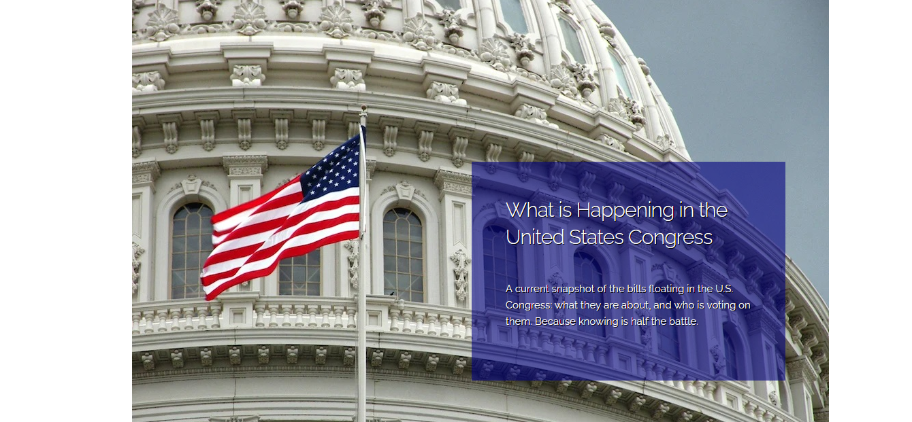

# Congress-Bill-Tracker

This application allows you to search and display bills in Congress.

## Usage

Link to the application: https://david-v-rullo.github.io/Congress-Bill-Tracker/

When the page loads, the most recent bill is displayed.

Once a topic and date range are selected, press the search buttons and results will be displayed below.

Arrows at the bottom of the page can progress through results.